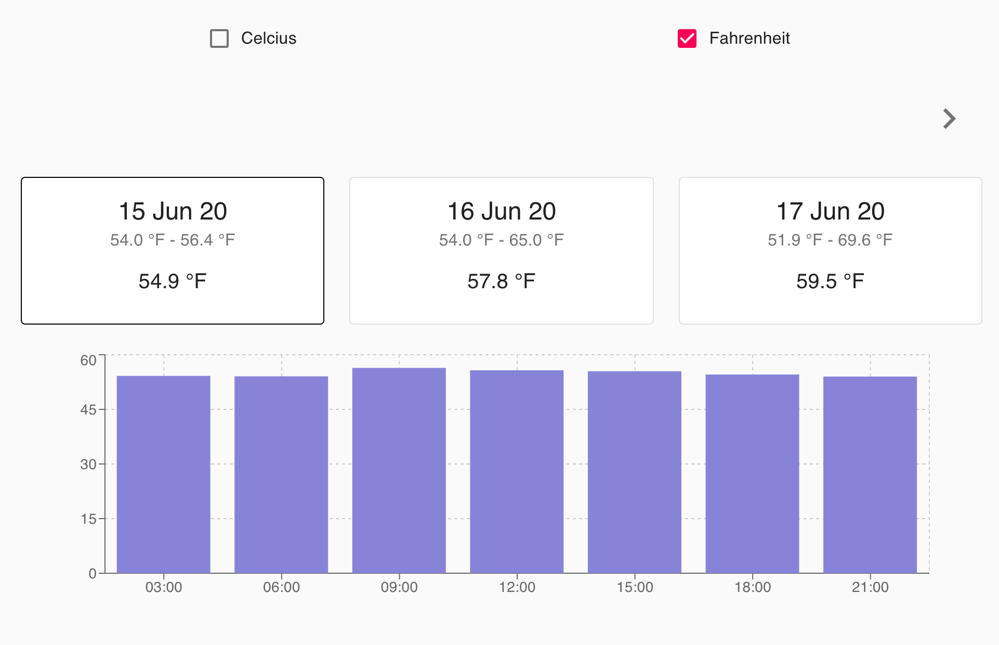
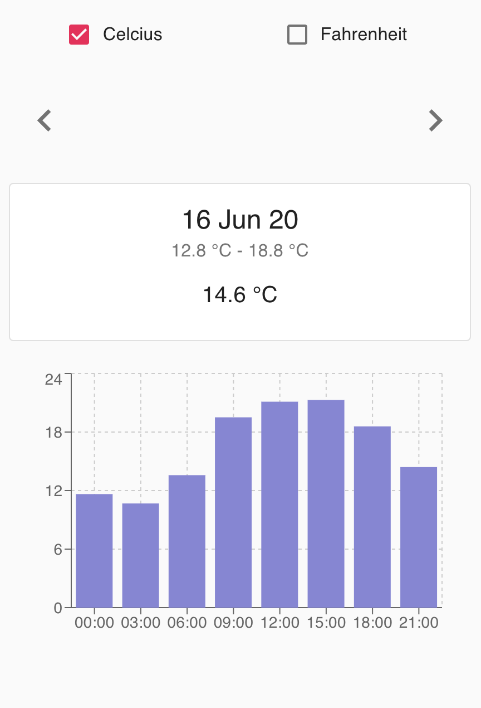

# Weather App

[See the live version here](https://berkeatac.github.io/weather-app/)




## Application
The application fetches and displays the weather data for next 5 days.<br>
Each card displays the date, minimum and maximum temperatures in the day and the average temperature.<br>
On card click, the 3-hourly data for the day is displayed in the bar chart below.

## Application Setup
Following commands install required dependencies and start the development server on port 8080.

```
npm install
npm run start
```

## Tests
Jest and enzyme are used to perform unit tests on functions and components.<br>
redux-mock-store is used for testing components connected to redux store.<br><br>
Following command starts running the unit and integration tests in the application.

```
npm run test
```

## Linter and Prettier
ESLint with AirBnB's preset of rules is used for linting, along with Prettier.

## Typechecking
Typechecking for all component props is provided using PropTypes library.

## Bundler
Webpack with a custom setup is used to bundle the project.

## Accessibility
Every function and navigation in the application can be controlled using keyboard only.

## Package Manager
npm is used for package management. Just a preference.

## Libraries

* [React.js](https://github.com/facebook/react/)
* [Redux](https://github.com/reduxjs/react-redux)
* [Material-UI](https://github.com/mui-org/material-ui)
* [Recharts](https://github.com/recharts)
* [Webpack](https://github.com/webpack/webpack)
* [Moment](https://github.com/moment/moment/)